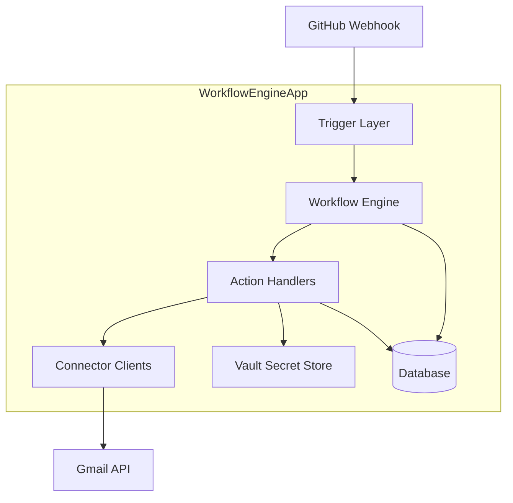

# Architecture Overview

The architecture diagram represents a modular workflow automation engine (WorkflowEngineApp) designed for event-driven processing, such as triggering actions based on external events like GitHub webhooks. It uses a layered approach to decouple concerns:

- **External Systems**: GitHub sends webhooks to initiate workflows, while the engine interacts with APIs like Gmail for actions.
- **Core Components**:
  - **Trigger Layer**: Captures and filters incoming events (e.g., issue creation).
  - **Workflow Engine**: Orchestrates the flow, matching triggers to defined workflows.
  - **Action Handlers**: Execute specific tasks (e.g., sending emails) using data from the execution context.
  - **Connector Clients**: Handle API integrations (e.g., Gmail API calls) in a reusable way.
  - **Vault Secret Store**: Securely manages OAuth tokens and secrets, avoiding database storage for security.
  - **Database**: Stores workflow definitions, integrations, and execution metadata.
- **Data Flow**: Events flow from Trigger → Engine → Action → Connector, with actions pulling secrets from Vault and data from the DB for persistence and context passing.
- **Benefits**: This design enables scalability, security, and extensibility—new triggers/actions/connectors can be added without disrupting the core engine. It's container-friendly for deployment (e.g., via Docker), isolating components for better maintainability.

