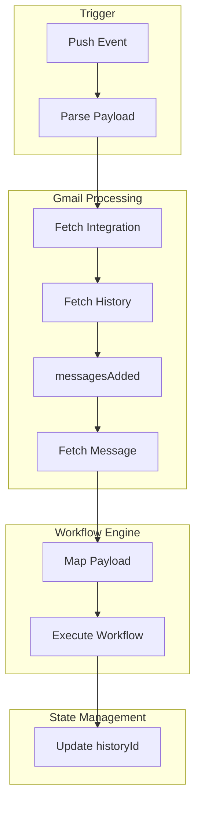

# 📧 Gmail Connector

**Status:** ✅ Production Ready  
**Connector Key:** `gmail`

---

## 🎯 Overview

The Gmail connector enables Geni to:

- Receive real-time email events using Gmail Push Notifications
- Fetch full email content including attachments
- Perform actions like sending, replying, searching, and managing emails

This connector uses a **push + history API model**, ensuring efficient and scalable event processing.

---

## 🔐 OAuth Setup

Gmail uses OAuth 2.0 for authentication.

### Required Scopes

- https://www.googleapis.com/auth/gmail.readonly
- https://www.googleapis.com/auth/gmail.send
- https://www.googleapis.com/auth/gmail.modify
- https://www.googleapis.com/auth/userinfo.email
- https://www.googleapis.com/auth/userinfo.profile

---

## ⚙️ Installation Flow

### 1. Redirect to Google Consent Screen

User is redirected to Google's OAuth URL with required scopes.
As part of callback we get a code which will be used to get access and refresh token.

---

### 2. Exchange Authorization Code

POST https://oauth2.googleapis.com/token

Response includes:

- access_token
- refresh_token
- expires_in

---

### 3. Fetch User Email

GET https://www.googleapis.com/oauth2/v3/userinfo

Used to identify the integration.

---

### 4. Setup Gmail Watch (Push Notifications)

POST https://gmail.googleapis.com/gmail/v1/users/me/watch

Request:

    {
      "topicName": "projects/.../topics/...",
      "labelIds": ["INBOX"]
    }

Response:

- historyId
- expiration

---

## 🗄️ Integration Storage

### Database (`integration.metadata`)

- email
- historyId
- watchExpiresIn

### Vault

- access_token
- refresh_token

> Tokens are securely stored and never persisted in the database.

---

## 📡 Gmail Watch Setup

Steps to enable Gmail push notifications:
[This already happens in registration flow under GmailConnectorHandler.java]
1. Obtain `access_token` after OAuth flow
2. Call Gmail Watch API

   POST https://gmail.googleapis.com/gmail/v1/users/me/watch

3. Send request body:

   {
   "topicName": "projects/{project-id}/topics/{topic-name}",
   "labelIds": ["INBOX"]
   }

4. Include header:
   [This access_token tells Google pub/sub to send events for this gmail account].

   Authorization: Bearer <access_token>

5. Receive response:

   {
   "historyId": "...",
   "expiration": "..."
   }

6. Store:
    - `historyId` → used for fetching email changes
    - `expiration` → used to renew watch

7. Use `historyId` to fetch events via Gmail History API

---

## 🔔 Triggers

| Key | Description |
|-----|------------|
| GMAIL_NEW_EMAIL | Triggered when a new email is received |

---

## 🎬 Actions

| Key | Description |
|-----|------------|
| GMAIL_SEND_EMAIL | Sends an email |
| GMAIL_CREATE_DRAFT | Creates an email draft |
| GMAIL_DELETE_EMAIL | Deletes an email |
| GMAIL_SEARCH_EMAIL | Searches emails |
| GMAIL_REPLY_EMAIL | Replies to an email |

---

## 🔄 Event Processing Flow

Gmail Push Notifications do not include full email content.

Instead, they provide:

- emailAddress
- historyId

---

## 📥 Email Fetching Flow

### Step 1: Receive Push Event

Webhook receives:

- emailAddress
- historyId

---

### Step 2: Fetch Integration

- Resolve integration using emailAddress

---

### Step 3: Fetch History

GET /gmail/v1/users/me/history?startHistoryId=LAST_HISTORY_ID

Used to detect:

- messagesAdded

---

### Step 4: Process Messages

For each messagesAdded:

- Extract messageId
- Identify trigger → GMAIL_NEW_EMAIL

---

### Step 5: Fetch Full Message

GET /gmail/v1/users/me/messages/{messageId}

Returns:

- Headers (subject, from, to)
- Body (base64 encoded)
- Attachments metadata

---

### Step 6: Map to Internal Payload

- Convert API response → GmailMessagePayload
- Extract:
    - subject
    - body
    - sender
    - recipients

---

### Step 7: Fetch & Embed Attachments

We dont support attachments now .

---

### Step 8: Execute Workflow

Trigger → Handler → Workflow Execution

---

## ⚡ Internal Execution Flow

---

## 🔁 History Tracking

- historyId is stored in integration metadata
- After processing:

Update historyId → Prevent duplicate processing

---

## 🔐 Token Handling

- Access token used for Gmail API calls
- Refresh token used when token expires
- Tokens stored securely in Vault

---

## ⚠️ Important Notes

- Gmail push does NOT include email content
- Always fetch message using messageId
- History API is required to detect changes
- Watch expires periodically and must be renewed
- Duplicate events can occur → ensure idempotency

---

## 🚀 Example Workflow

    {
      "name": "New Email → Create GitHub Issue",
      "trigger": {
        "type": "GMAIL_NEW_EMAIL"
      },
      "actions": [
        {
          "type": "GITHUB_CREATE_ISSUE",
          "inputs": {
            "title": "${trigger.subject}",
            "body": "${trigger.body}"
          }
        }
      ]
    }

---

**Maintained by:** Geni Team  
**Status:** Active